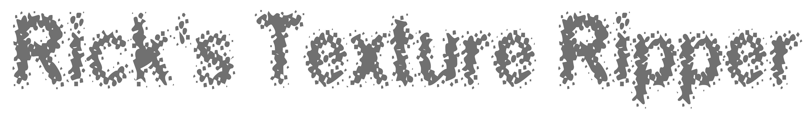

<p align="center">
  
</p>
Rick's Texture Rippper or RTR is a desktop tool for ripping flat textures out of photos and packing them into a texture atlas. Select a region in a photo, correct its perspective, and the result is added to a single atlas image you can export.

<p align="center">

</p>
<p height="20px"></p>
<p align="center">

</p>
Rick's Texture Ripper - Built in Rust - Version 1.3.0 

## Navigation

- **Zoom** — mouse wheel
- **Pan** — middle mouse button
- **Move an image** — Shift + left-drag
- **Edit a rip** — left-drag its handles

## Features

- **Perspective rips** — draw a quad over a surface in a photo; the four corners can be moved freely to un-warp perspective into a flat texture. Circle selections are also supported.
- **Live editing** — rips recompute as you drag.
- **Atlas packing** — all rips are packed into one image.
  - *Automatic* sort packs rips tightly into the chosen aspect ratio and scales non-custom rips toward an even size.
  - *Manual* sort lets you place each rip by hand, with optional snapping to a grid and to nearby rip edges.
- **Aspect ratio control** — Automatic, Square, or Custom width/height; rips are never stretched.
- **Image adjustments** — non-destructive brightness, contrast, saturation, and resize, applied per rip or per source image.
- **Dockable panels** — Texture View, Atlas View, Rips Gallery, and Image Edit can be arranged, saved, and reloaded as named layouts.
- **Projects** — save and open `.rtrpf` project files. Source images are embedded, so a project still loads after the originals are moved or deleted.
- **Undo/redo**, a recent-files list, light and dark themes.
- **Windows integration** — per-user `.rtrpf` file association.

## Usage

1. **Add Image** (Ctrl+T) to load a photo.
2. **Add Rip** (Ctrl+R) and drag the corners over the surface you want.
3. Open the **Atlas View** to arrange and size the rips.
4. **Export Atlas** (Ctrl+X) to write the PNG.

The in-app **Help > Info** window lists every control and shortcut.


## Build and run

Requires a stable Rust toolchain (`cargo`).

```
git clone https://github.com/L30ZMine/ricks-textureripper.git
cd ricks-textureripper
cargo run --release
```

The release build has no console window. A debug build (`cargo run`) keeps one for logging.

The application runs on Windows, Linux, and macOS. The executable icon and `.rtrpf` file association are Windows-only for now.


### Hotkeys

| Action | Shortcut |
| --- | --- |
| Add Image / Add Rip / New Project | Ctrl+T / Ctrl+R / Ctrl+F |
| Open Project | Ctrl+G |
| Save / Save As / Export Atlas | Ctrl+S / Ctrl+Shift+S / Ctrl+X |
| Undo / Redo | Ctrl+Z / Ctrl+Y |
| Remove selected rip or active image | Delete / Backspace |
| Toggle Texture / Atlas / Rips / Image Edit panels | Alt+1 / Alt+2 / Alt+3 / Alt+4 |
| Quit | Ctrl+Q |

## Tech stack

`eframe` + `egui` (GUI), `egui_dock` (panels), `image` (decode/encode), `rectangle-pack` (packing), `rfd` (file dialogs), `serde` (project and config files).

## License

No license has been specified yet.

## Author

[l30z](https://github.com/L30ZMine)
